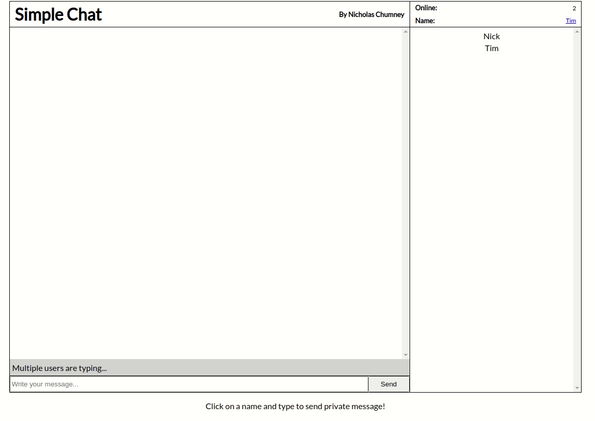

# Simple Chat
A chat web application created using **ejs, Node.js, Express.js and Socket io**.

## Demo


## Development Setup

### Prerequisites
- Node
- npm

### Configuration
1) Clone the repo
2) Install dependencies with `npm install`
3) Copy the file `.env.example` and rename it `.env`. This file contains the name of required environment variables needed for the application to work.

```
NODE_ENV=           # 'development' or 'production'
PORT=               # port to run the server on
```

4) Start the application using `npm start` or `npm run dev` for automatic reloading


### Testing
Use `npm test` to run test cases using mocha

### Deployment
Not deployed.
